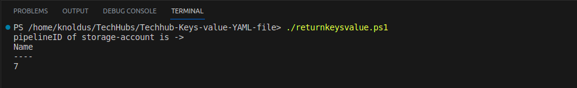

# Short Description About this template
This PowerShell script helps you get the particular Key value from the YAML file

In this tech hub, we can see that it returns the value when passing the key name resourceType. 
for example when we pass the resource Type storage-account then it will return its pipelineID 7

# Steps for Execution 
1. clone the repository  
2. ./returnkeysvalue.ps1

As shown in the image below, this will return the key resource type value.

